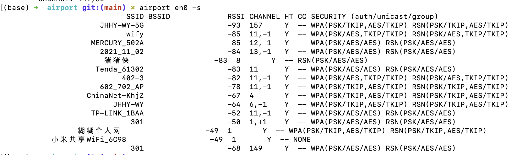
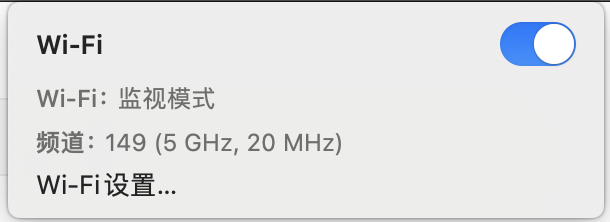

# airport

# 一、airport是啥？

airport是MAC自带的无线网络管理工具，可以通过这个工具加入无线网络、创建热点、配置无线安全设置等。

# 二、将airport加入$PATH

MAC上默认的airport可执行文件的路径： 

```bash
/System/Library/PrivateFrameworks/Apple80211.framework/Versions/Current/Resources/airport
```

`/usr/local/bin`路径下的文件都包含在PATH中可以不用全路径就能执行，因此我们在`/usr/local/bin`下创建一个软连接，以方便直接使用`airport`短名称访问：

```bash
sudo ln -s /System/Library/PrivateFrameworks/Apple80211.framework/Versions/A/Resources/airport /usr/local/bin/airport
```

然后再执行`airport`：

```bash
(base) ➜  airport git:(main) ✗ airport
Usage: airport <interface> <verb> <options>

	<interface>
	If an interface is not specified, airport will use the first AirPort interface on the system.

...
```

# 三、基本操作

## 3.1 查看网卡信息

查看当前的网卡的信息：

```bash
airport -I
```

输出结果：

```bash
(base) ➜  airport git:(main) ✗ airport -I
     agrCtlRSSI: -59 # 表示信号强度，数值越接近0表示信号越好
     agrExtRSSI: 0 # 扩展信号强度，这里显示为0，可能表示没有使用或不支持。
    agrCtlNoise: -94 # 这是一个噪声级别指标，-94 表示当前无线信号的噪声水平，数值越低表示噪声越小。
    agrExtNoise: 0 # 扩展噪声级别指标，这里显示为0，可能表示没有使用或不支持。
          state: running # 显示无线接口的状态，这里是 "running"，表示无线接口正在运行。
        op mode: station # 显示操作模式，这里是 "station"，表示设备作为无线网络的客户端。
     lastTxRate: 86 # 上次传输速率，86 可能表示上次传输使用的速率。
        maxRate: 144 # 最大传输速率，144 表示设备能支持的最大传输速率。
lastAssocStatus: 0 # 上次关联状态，0 通常表示成功。
    802.11 auth: open # 无线网络的认证方式，这里是 "open"，表示没有使用加密。
      link auth: wpa2-psk # 链路认证方式，这里是 "wpa2-psk"，表示使用了 WPA2 加密。
          BSSID: # 基本服务集标识符，是无线接入点的MAC地址。
           SSID: 301 # 服务集标识符，是无线网络的名称，这里是 "301"，这是笔者连接的公共WiFi
            MCS: 12 # 调制和编码方案，12 表示使用的MCS级别。
  guardInterval: 800 # 保护间隔，800 可能是时间单位，表示保护间隔的长度。
            NSS: 2 # 空间流的数量，2 表示使用了两个空间流。
        channel: 1 # 无线信号使用的频道，这里是 1。
```

## 扫描周围的WiFi

扫描附近可用的无线网络并列出详细信息：

```bash
airport en0 -s
```

输出，下面需要重点关注的列就是SSID，后面要连接到WiFi的话需要使用SSID连接：



## 连接WiFi

```bash
sudo airport en0 join [SSID] [密码]
```

例子：

```bash
sudo airport en0 join 301 88888888
```

- `en0` 或 `en1` 是你的无线网络接口，可以通过 `ifconfig` 命令查找。
- `[SSID]` 是你要连接的 Wi-Fi 网络的名称。
- `[密码]` 是该 Wi-Fi 网络的密码。


## 断开连接

连接：

```bash
sudo airport -z
```


```bash
sudo airport en0 disconnect [SSID]
```


## 列出已连接wifi信息

列出当前已经连接的无线网络的详细信息：

```bash
airport -l
```


断开当前连接的网络：

```bash
airport -z
```


以管理员权限启动：

```bash
airport -A
```


查看附近有没有WEP加密类型的WIFI：

```bash
airport en0 -s | grep WEP
```

不过一般是没有这个运气的，现在基本上已经看不到WEP类型加密的WIFI了。


# 嗅探流量（802.11）

嗅探流量，抓包的结果通常被保存到`airportSniffXXXXXX.cap`格式的文件中：

```bash
sudo airport en0 sniff
```

需要注意的两个点：

- 是抓包需要管理员权限
- 抓包的时候不能联网，网卡会变成监视模式：

  

抓到的包可以通过aircrack-ng分析：

```bash
sudo aircrack-ng /tmp/airportSniffXXXXXX.cap
```

擦，不让运行aircrack-ng....


- https://github.com/xwmx/airport/blob/master/airport
- https://github.com/zhovner/airport-sniffer


